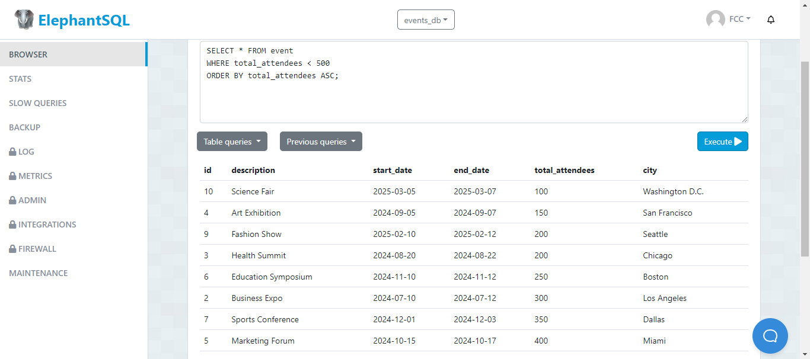
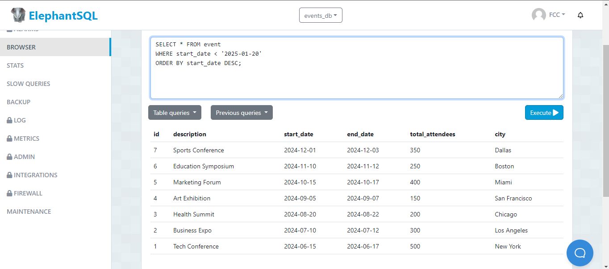
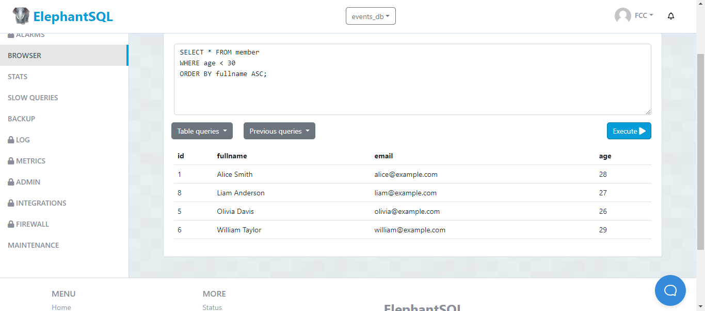
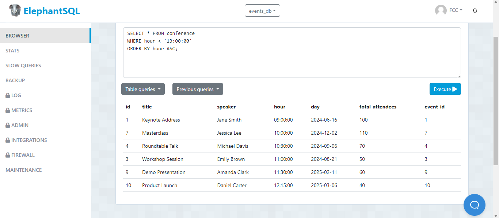
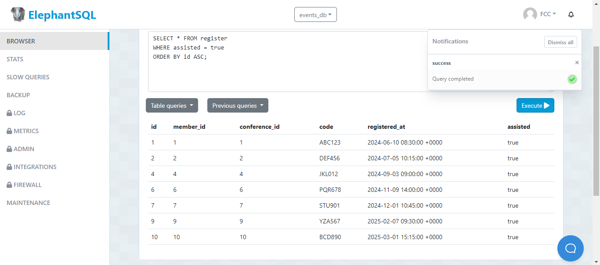

# Tarea TAS7 - Events

## 1. Listar el total de asistentes menores a 500 al evento y ordenados por el total de asistentes de manera ascendente:
  - Sentencia:
  ```
  SELECT * FROM event WHERE total_attendees < 500 ORDER BY total_attendees ASC;
  ```
  - Captura:


## 2. Listar los eventos que sucedieron antes del '2025-01-20' ordenados por fecha de inicio descendente:
  - Sentencia:
  ```
  SELECT * FROM event WHERE start_date < '2025-01-20' ORDER BY start_date DESC;
  ```
  - Captura:


## 3. Listar los member menores de 30 años ordenados por nombre completo de manera ascendente:
  - Sentencia:
  ```
  SELECT * FROM member WHERE age < 30 ORDER BY fullname ASC;
  ```
  - Captura:


## 4. Listar las conferencias que se ha iniciado antes de la 13:00:00 ordenados por hora de manera ascendente.
  - Sentencia:
  ```
  SELECT * FROM conference WHERE hour < '13:00:00' ORDER BY hour ASC;
  ```
  - Captura:


## 5. Listar los register donde las personas si han asistido (true) y ordenarlos de manera ascendente por el id
  - Sentencia:
  ```
  SELECT * FROM register WHERE assisted = true ORDER BY id ASC;
  ```
  - Captura:


